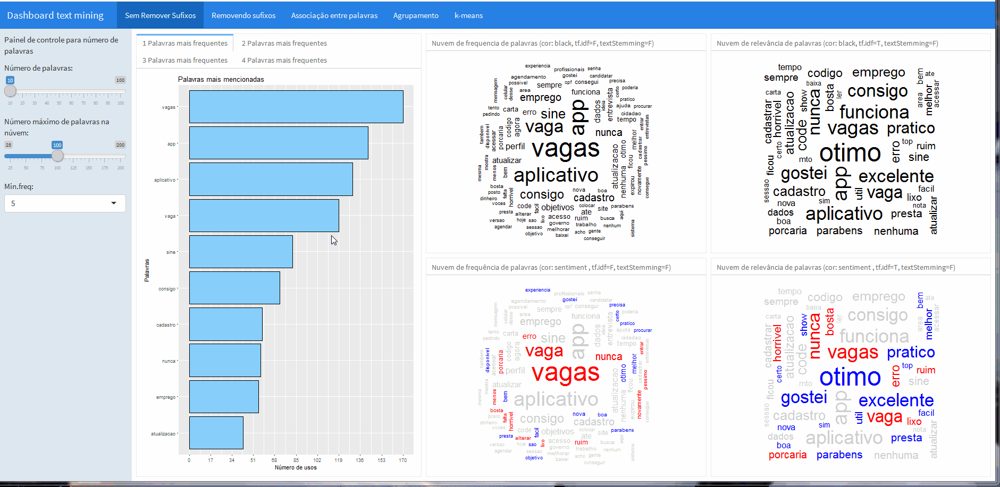
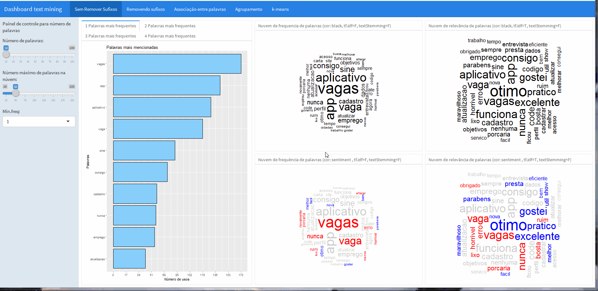
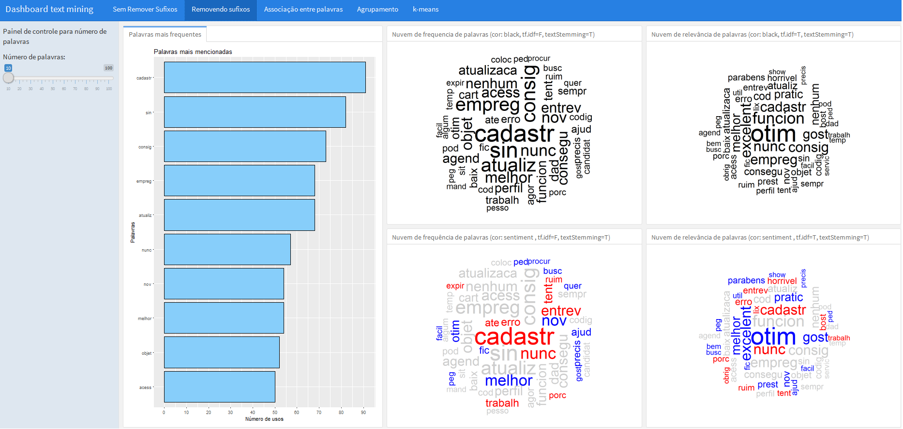
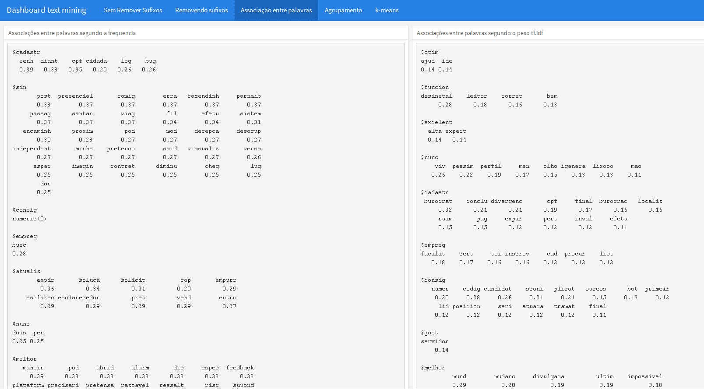
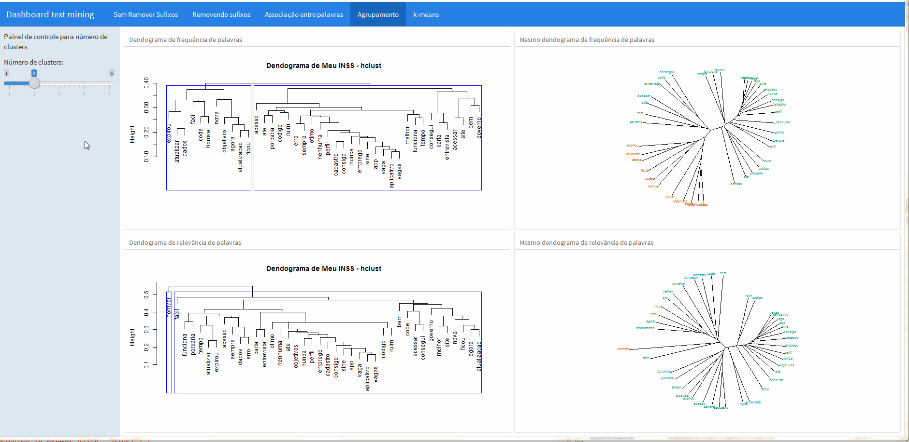
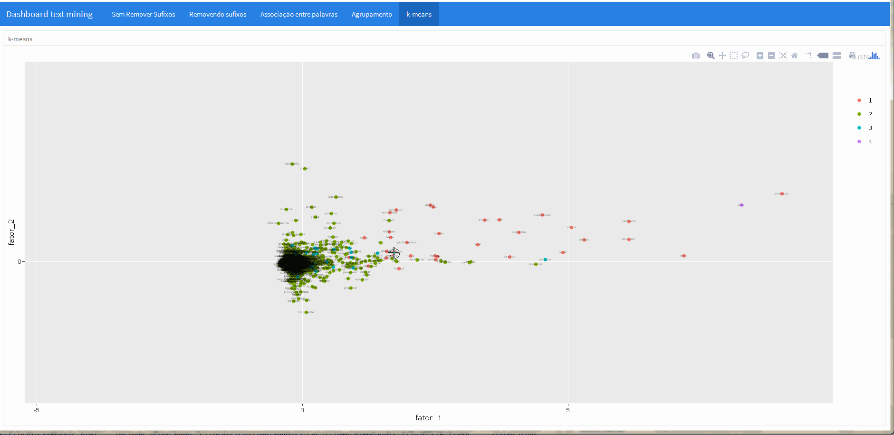

# Dashboard text mining v1

Link de acesso ao dashboard : [https://gomesfellipe.shinyapps.io/dashboard-text-mining-1/](https://gomesfellipe.shinyapps.io/dashboard-text-mining-1/)

## Motivação

Elaborar este dashboard foi uma tarefa que decidi executar pois me foi perguntado se era possível "alguma coisa" com os obtidos através da ferramenta [Social Searcher](https://www.social-searcher.com/) responsável por captar informações  de diferentes mídias sociais sob algum tópico de interesse.

Decidi então praticar a criação de dashboards com R e juntei algumas abordagens simples de text mining em um dashboard produzido através do pacote [flexdashboard](http://rmarkdown.rstudio.com/flexdashboard/) disponível no CRAN.

Portanto este dashboard não foi programado para funcionar de maneira genérica, as diversas funcionalidades devem ser adaptadas caso seja utilizado para analisas novas bases.

## Arquivos

Esta pasta contém os seguintes arquivos:

* Código responsável por gerar o dashboard

    * dashboard-text-mining-1.Rmd

* Bases:

    * base.xlsx - exemplo de dados obtidos com a ferramenta [Social Searcher](https://www.social-searcher.com/)

    * sentimentos.csv - base com classificação de sentimentos (lexical) 

* Funções:

    * catch_error.R
    * cleanTweets.R
    * cleanTweetsAndRemoveNAs.R
    * html_to_text.R
    * plot_kmeans.R
    * rm_accent.R
    * rquery_wordcloud.R
    * score.sentiment.R

Mais informações sobre funções de textmining podem ser obtidas [neste link](https://sites.google.com/site/miningtwitter/home)

## Dashboard

Este dashboard conta com 5 abas. Além da base de dados obtida com o [Social Searcher](https://www.social-searcher.com/), também foi utilizada o pacote [lexiconPT](https://cran.r-project.org/web/packages/lexiconPT/index.html) que conta com alguns datasets lexicos para  análise de texto em português. Com essa duas bases foi computada a interseção e os sentimentos de cada palavra foram registrados (qualquer nova palavra pode ser adicionada ao dicionário lexico posteriormente para enriquecer a apresentação visual).

#### "Sem remover sufixos"

A primeira parte do dashboard apresenta 4 nuvens de palavras, na parte superior a primeira nuvem não foi feita a transformação [tf-idf](https://pt.wikipedia.org/wiki/Tf%E2%80%93idf), já na nuvem a direita essa transformação foi feita e ambas dispostas lado a lado para avaliar o efeito da transformação no shape da nuvem.

Já as nuvems da parte inferior são versões das nuvens acima, realizando a análise lexical.

Com os botões é possível controlar a frequência minima e o número máximo de palavras na nuvem.

Além disso, ao lado da barra lateral dos botões é possível conferir a frequência de palavras únicas e também sequencias de palavras, que foram computadas com a ajuda do pacote [RWeka](https://cran.r-project.org/package=RWeka) (ferramenta interessante para aplicações de machine learning e data mining).

#### "Removendo sufixos"

A segunda aba possui basicamente as mesmas características da primeira, porém nesta seção foi realizada a retirada dos radicais com a função `SnowballC::wordStem()`, veja:

#### "Associação entre palavras"

A terceira aba é responsável por trazer o resultados do comando `tm::findAssocs` que busca associações entre palavras em um `document-term` ou  uma `term-document`, do pacote [tm](https://cran.r-project.org/web/packages/tm), muito famoso quando o assunto é text mining.

#### "Agrupamento"

Para efeito de ilustração do que pode ser feito, nesta aba foi feita uma análise de clusters calculando a distância euclideana e agrupando os dados de acordo com o método de Ward.

O dendograma pode ser apresentado de muitas formas diferentes, então nesta apresentação coloquei à direita a representação convencional e à direita o mesmo dendograma é apresentado de maneira "aberta" e colorida, facilitando a visualização dos grupos formados.

#### "k-means"

Na última aba foi apresentado uma aplicação do algorítimo k-means, uma técninca simples de agrupamento utilizado em procedimentos não supervisionados de machine learning.

Em conjunto com a função `ggplotly` do pacote [plotly](https://cran.r-project.org/web/packages/plotly) fica muito simples tornar esta imagem interativa, veja:

## Considerações Finais

Criar este dashboard foi bem divertido e serviu como um treino prático para criar dashboards e aplicativos shiny. Não foram feitas novas alterações no painel e a idéia serviu de impulso para criar um aplicativo shinny que fosse responsável por gerar 1 nuvem de palavra a partir de qualquer base de dados obtida com a ferramenta [Social Searcher](https://www.social-searcher.com/) de forma que o usuário pudesse escolher os parâmetros de funcionalidades como as apresentadas aqui para sua nuvem e salvá-la para o uso posterior em seus relatórios.
